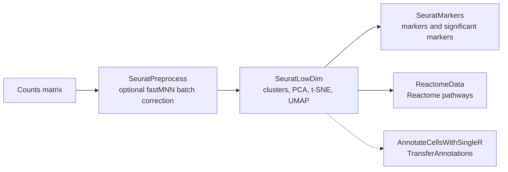

scPipeline, a R package that uses Seurat, ReactomeGSA, fastMNN and singleR to enable the user to build an end-to-end single cell pipeline:

Seurat: A comprehensive toolkit for single-cell RNA-seq data analysis, offering functionalities from data preprocessing to visualization.

batchelor: Provides methods for batch correction in single-cell RNA-seq data, including the fastMNN function.

singleR: Facilitates single-cell RNA-seq data annotation, aiding in cell type identification.

GSEA: Enables gene set enrichment analysis to identify pathways or gene sets that are significantly enriched in a dataset.
## Seurat wrapper to report expressed markers and associated Reactome pathways.

This repository is a simple R package that has 4 main functionalities:  
1. SeuratPreprocess function to transform counts data to scaled seurat object,  
2. SeuratLowDim function to convert the scaled object to low-dimensinoal object with cluster information,  
3. SeuratMarkers function identifies the entire list of markers, along with significant markers (based on minimum percent of cells) and  
4. ReactomeData function to identify the Reactome GSA pathways on the expressed genes in the clusters.  

Additonal advanced functionalities of transferring cell-annotations, and identifying the annotations using SingleR package are also available.
5. ConvertGeneIdentifiers to convert different accessions to gene symbols or vice versa.
6. AnnotateCellsWithSingleR uses celldex reference annotations to transfer to the current dataset.
7. Transfer Annotations uses the labelled datasets from one dataset and transfers to the other.

```{r cars}
library(Seurat)
library(ReactomeGSA)
library(tidyverse)
library(scPipeline)
```

```{r}
# Loading sample counts data (Mouse cell atlas)
mca.matrix <- readRDS(file = "data/MCA_merged_mat.rds")
mca.metadata <- read.csv(file = "data/MCA_All-batch-removed-assignments.csv", row.names = 1)
mca.matrix.1K <- mca.matrix[,1:1000]
```

[1]. SeuratPreprocess Function to convert Counts Data to Normalized and Scaled Seurat object for highly variable genes.  
```{r SeuratPreprocess function}
scaled_seurat_object <- SeuratPreprocess(mca.matrix.1K)
```

[2]. SeuratLowDim Function to convert Scaled Seurat Object from [1] to object that has clusters identified and data transformed to visualize in 2d (ie, PCA followed by t-SNE and UMAP).  
```{r SeuratLowDim function}
low_dim_object <- SeuratLowDim(scaled_seurat_object)
```

[3]. SeuratMarkers Function to convert seurat object to all markers list, along with significant markers (based on minimum percent of cells in the cluster).  
```{r SeuratMarkers function}
Markers_list <- SeuratMarkers(low_dim_object)
```

[4]. ReactomeData Function to convert seurat object to get the pathways identified using ReactomeGSA R package.  

```{r ReactomeData function}
Reactome_pathways_object <- ReactomeData(low_dim_object)
```

## Installation

scPipeline is available on CRAN:

```r
install.packages("scPipeline")
```

Several dependencies come from Bioconductor. If installation reports missing packages, install them first:

```r
if (!requireNamespace("BiocManager", quietly = TRUE)) install.packages("BiocManager")
BiocManager::install(c("batchelor", "SingleR", "celldex", "SummarizedExperiment", "biomaRt", "ReactomeGSA"))
```

Alternative sources:

```r
# Development version from GitHub
install.packages("remotes")
remotes::install_github("sridhara-omics/scPipeline")

# R-universe build
install.packages("scPipeline",
                 repos = c("https://sridhara-omics.r-universe.dev", "https://cloud.r-project.org"))
```

**Requirements:** R . Main dependencies: Seurat, batchelor, SingleR, celldex, ReactomeGSA,
SummarizedExperiment, biomaRt, dplyr, magrittr and rlang.

## Function reference at a glance

| Function | What it does |
|---|---|
| `SeuratPreprocess()` | Preprocesses a counts matrix into a normalized, scaled Seurat object; optional batch correction with `batchelor::fastMNN` using a batch vector |
| `SeuratLowDim()` | Builds the low-dimensional object from the scaled object: clusters plus PCA, t-SNE and UMAP embeddings |
| `SeuratMarkers()` | Finds markers per cluster and returns the full list plus a thresholded list of significant markers (minimum percent of cells) |
| `ReactomeData()` | Runs Reactome pathway analysis (ReactomeGSA) on a Seurat object that has cluster information |
| `AnnotateCellsWithSingleR()` | Annotates cells with SingleR using a celldex reference; annotations are added to the Seurat metadata |
| `TransferAnnotations()` | Transfers annotations from a labelled dataset to Seurat clusters |
| `ConvertGeneIdentifiers()` | Converts gene identifiers in a Seurat object (for example accessions to gene symbols) |

Use `?SeuratPreprocess` (or any function name) for argument details.

## Workflow overview



`ConvertGeneIdentifiers()` is a supporting step for working with different gene identifier types.

## What you get back

| Step | Result |
|---|---|
| `SeuratPreprocess()` | A scaled Seurat object restricted to highly variable genes |
| `SeuratLowDim()` | A Seurat object with cluster assignments and 2-D embeddings for plotting |
| `SeuratMarkers()` | A list with all markers and the significant markers |
| `ReactomeData()` | A ReactomeGSA result object with pathways for the expressed genes in each cluster |
| `AnnotateCellsWithSingleR()` | The Seurat object with predicted cell types in the metadata |

## Example data

The usage examples above read `data/MCA_merged_mat.rds` and `data/MCA_All-batch-removed-assignments.csv` 

## Help and documentation

- Package page on CRAN: <https://CRAN.R-project.org/package=scPipeline>
- Function help: `help(package = "scPipeline")`
- Vignettes (if installed): `browseVignettes("scPipeline")`
- Release notes: see [`NEWS.md`](NEWS.md)

## Reproducibility tips

- Set a seed (`set.seed(...)`) before clustering and embedding steps (UMAP and t-SNE are stochastic).
- Record `sessionInfo()` with your results so package versions are traceable.
- Note the celldex reference used for annotation, since predicted labels depend on it.

## Citation

If you use scPipeline, please cite the package and the tools it builds on.

```r
citation("scPipeline")
```

```bibtex
@Manual{sridhara_scpipeline,
  title  = {scPipeline: A Wrapper for 'Seurat' and Related R Packages for End-to-End Single Cell Analysis},
  author = {Viswanadham Sridhara},
  year   = {2025},
  note   = {R package version 0.2.0.0},
  doi    = {10.32614/CRAN.package.scPipeline},
  url    = {https://CRAN.R-project.org/package=scPipeline}
}
```

Key methods used by the package:

- Hao, Y. et al. *Integrated analysis of multimodal single-cell data.* Cell (2021). (Seurat)
- Haghverdi, L. et al. *Batch effects in single-cell RNA-sequencing data are corrected by matching mutual nearest neighbors.*
  Nature Biotechnology (2018). (fastMNN)
- Aran, D. et al. *Reference-based analysis of lung single-cell sequencing reveals a transitional profibrotic macrophage.*
  Nature Immunology (2019). (SingleR)
- Griss, J. et al. *ReactomeGSA - Efficient multi-omics comparative pathway analysis.* Molecular Systems Biology (2020).

## License

Released under the MIT License. See [`LICENSE`](LICENSE).

## Contributing and issues

Bug reports and suggestions are welcome via [GitHub Issues](https://github.com/sridhara-omics/scPipeline/issues). Please include your
`sessionInfo()` output and a minimal reproducible example.
